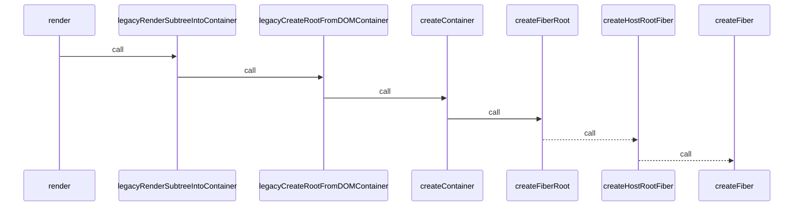
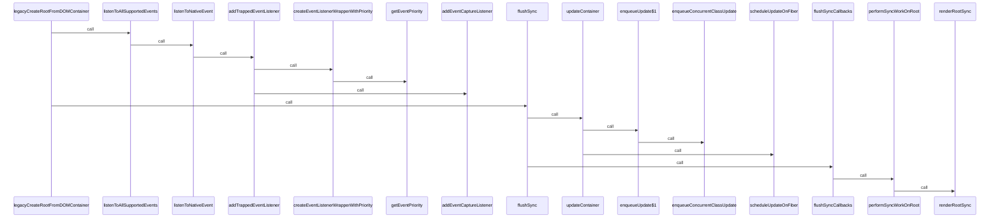
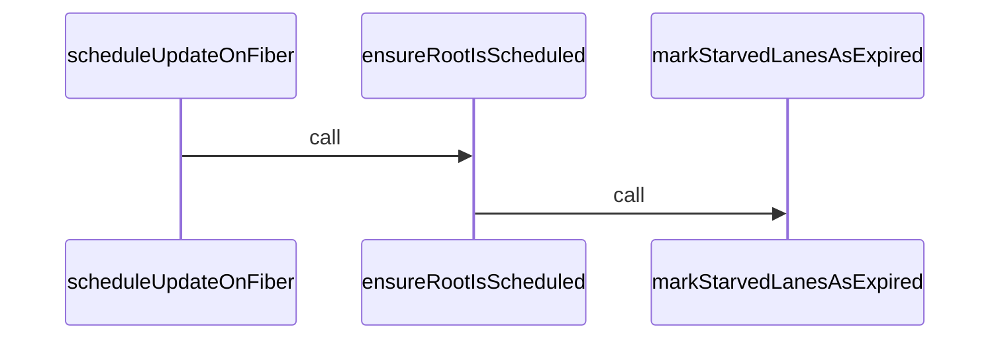

初次渲染关键路径

1. reactDOM.render

createElement (packages/react-dom/src/client/ReactDOMComponent.js:379)
    not commit yet
createInstance (packages/react-dom/src/client/ReactDOMHostConfig.js:269)
completeWork (packages/react-reconciler/src/ReactFiberCompleteWork.new.js:995)
completeUnitOfWork (packages/react-reconciler/src/ReactFiberWorkLoop.new.js:1954)
performUnitOfWork (packages/react-reconciler/src/ReactFiberWorkLoop.new.js:1927)
workLoopSync (packages/react-reconciler/src/ReactFiberWorkLoop.new.js:1815)
renderRootSync (packages/react-reconciler/src/ReactFiberWorkLoop.new.js:1774)
    prepareFreshStack assign to workInProgressRoot & workInProgress
performSyncWorkOnRoot (packages/react-reconciler/src/ReactFiberWorkLoop.new.js:1320)
flushSyncCallbacks (packages/react-reconciler/src/ReactFiberSyncTaskQueue.new.js:67)
flushSync (packages/react-reconciler/src/ReactFiberWorkLoop.new.js:1474)
    flushSync -> updateContainer finally call flushSyncCallbacks
        updateContainer 设置了 update 到 concurrentQueues
legacyCreateRootFromDOMContainer (packages/react-dom/src/client/ReactDOMLegacy.js:183)
legacyRenderSubtreeIntoContainer (packages/react-dom/src/client/ReactDOMLegacy.js:222)
render (packages/react-dom/src/client/ReactDOMLegacy.js:347)

## 读取 concurrentQueues
finishQueueingConcurrentUpdates (packages/react-reconciler/src/ReactFiberConcurrentUpdates.new.js:56)
prepareFreshStack (packages/react-reconciler/src/ReactFiberWorkLoop.new.js:1560)
renderRootSync (packages/react-reconciler/src/ReactFiberWorkLoop.new.js:1759)
performSyncWorkOnRoot (packages/react-reconciler/src/ReactFiberWorkLoop.new.js:1320)
flushSyncCallbacks (packages/react-reconciler/src/ReactFiberSyncTaskQueue.new.js:67)
flushSync (packages/react-reconciler/src/ReactFiberWorkLoop.new.js:1474)
legacyCreateRootFromDOMContainer (packages/react-dom/src/client/ReactDOMLegacy.js:183)
legacyRenderSubtreeIntoContainer (packages/react-dom/src/client/ReactDOMLegacy.js:222)
render (packages/react-dom/src/client/ReactDOMLegacy.js:347)
<anonymous> (packages/react-dom/src/__tests__/CSSPropertyOperations-test.js:76)
asyncJestTest (/Users/jiangbo/code/react/node_modules/jest-jasmine2/build/jasmineAsyncInstall.js:106)
<anonymous> (node_modules/jest-jasmine2/build/queueRunner.js:45)
mapper (node_modules/jest-jasmine2/build/queueRunner.js:28)
<anonymous> (node_modules/jest-jasmine2/build/queueRunner.js:75)
processTicksAndRejections (internal/process/task_queues:96)
Promise.then (Unknown Source:0)
<anonymous> (node_modules/jest-jasmine2/build/queueRunner.js:75)
queueRunner (node_modules/jest-jasmine2/build/queueRunner.js:74)
queueRunnerFactory (node_modules/jest-jasmine2/build/jasmine/Env.js:236)
execute (node_modules/jest-jasmine2/build/jasmine/Spec.js:169)

## 设置 concurrentQueues

enqueueUpdate (packages/react-reconciler/src/ReactFiberConcurrentUpdates.new.js:101)
enqueueConcurrentClassUpdate (packages/react-reconciler/src/ReactFiberConcurrentUpdates.new.js:152)
enqueueUpdate (packages/react-reconciler/src/ReactFiberClassUpdateQueue.new.js:271)
updateContainer (packages/react-reconciler/src/ReactFiberReconciler.new.js:382)
<anonymous> (packages/react-dom/src/client/ReactDOMLegacy.js:185)
flushSync (packages/react-reconciler/src/ReactFiberWorkLoop.new.js:1461)
legacyCreateRootFromDOMContainer (packages/react-dom/src/client/ReactDOMLegacy.js:183)
legacyRenderSubtreeIntoContainer (packages/react-dom/src/client/ReactDOMLegacy.js:222)
render (packages/react-dom/src/client/ReactDOMLegacy.js:347)
<anonymous> (packages/react-dom/src/__tests__/CSSPropertyOperations-test.js:76)
asyncJestTest (/Users/jiangbo/code/react/node_modules/jest-jasmine2/build/jasmineAsyncInstall.js:106)
<anonymous> (node_modules/jest-jasmine2/build/queueRunner.js:45)
mapper (node_modules/jest-jasmine2/build/queueRunner.js:28)
<anonymous> (node_modules/jest-jasmine2/build/queueRunner.js:75)
processTicksAndRejections (internal/process/task_queues:96)
Promise.then (Unknown Source:0)
<anonymous> (node_modules/jest-jasmine2/build/queueRunner.js:75)
queueRunner (node_modules/jest-jasmine2/build/queueRunner.js:74)
queueRunnerFactory (node_modules/jest-jasmine2/build/jasmine/Env.js:236)
execute (node_modules/jest-jasmine2/build/jasmine/Spec.js:169)

